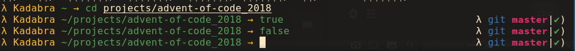
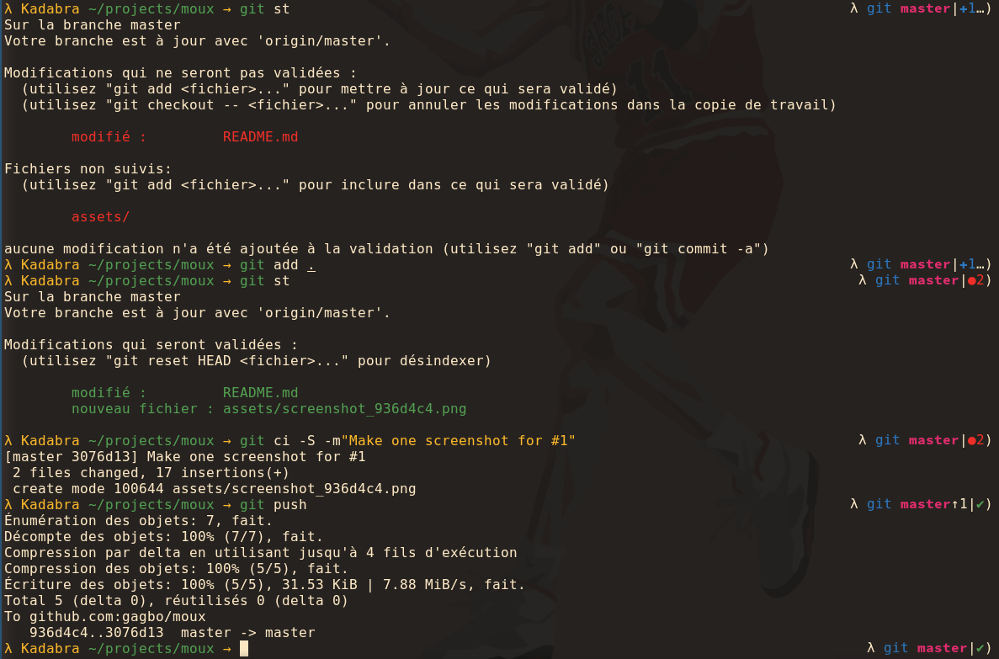

# moux
personal zsh theme

## Screenshot

The screenshot is not guaranteed to be up to date. This one has been made on 936d4c4

**Note** : I use the git plugin from oh-my-zsh to provide the right prompt with git
status (RPROMPT) in the screenshot

### Details

Terminal colorscheme : [srcery](https://github.com/srcery-colors/srcery-terminal)
Font : Source Code Pro

- The green colors of commands is due to zsh-users/zsh-syntax-highlighting
- Terminal is semi-transparent, that is why some icons are visible now
